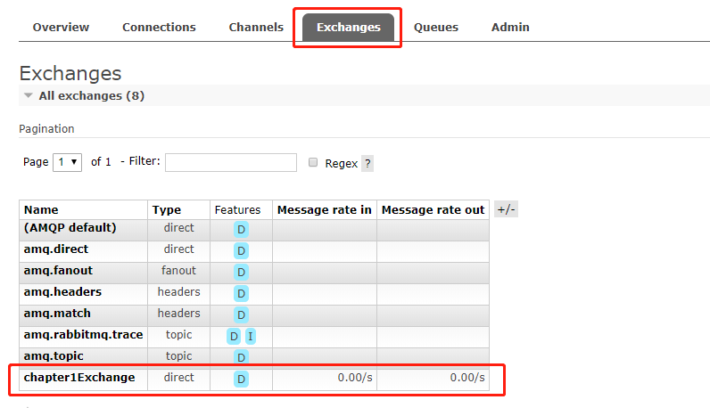
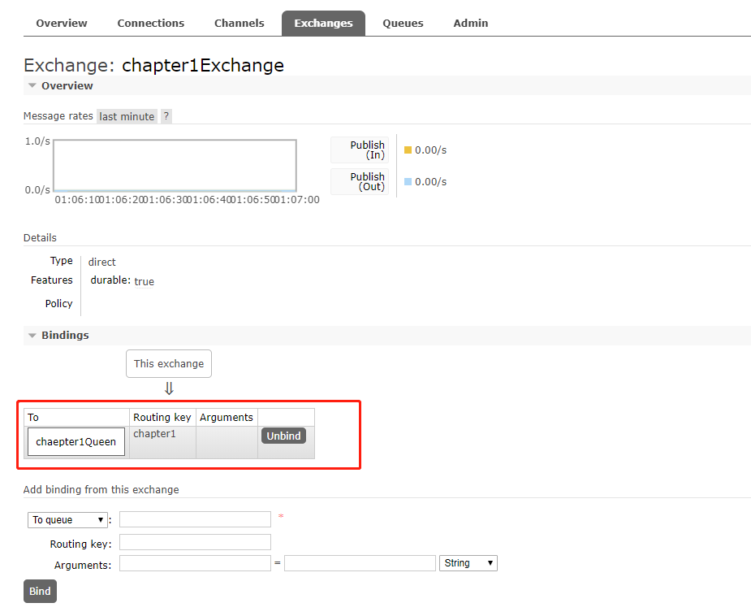
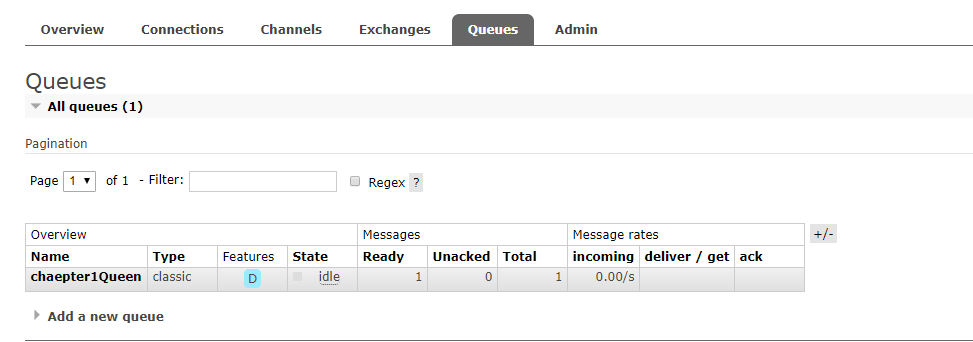

# 第一章 Rabbit 生产者 
## 1.创建macen项目 引入依赖(这里使用的是SpringBoot 项目)
```
        <dependency>
            <groupId>org.springframework.boot</groupId>
            <artifactId>spring-boot-starter-amqp</artifactId>
        </dependency>
```
或者单纯的maven项目依赖
```
        <dependency>
            <groupId>com.rabbitmq</groupId>
            <artifactId>amqp-client</artifactId>
            <version>4.2.1</version>
        </dependency>
```
上代码:
```java
public class RabbitProducer {
    public static void main(String[] args) throws IOException, TimeoutException {
        // 获取Rabbit 工厂
        ConnectionFactory factory = new ConnectionFactory();
        // 设置Rabbit 地址 端口 用户名 密码
        factory.setHost("127.0.0.1");
        factory.setPort(5672);
        factory.setUsername("guest");
        factory.setPassword("guest");
        // 创建链接
        Connection connection = factory.newConnection();
        // 创建连接通道
        Channel channel = connection.createChannel();
        // 第一个参数:交换机名称
        // 第二个参数交换机类型
        // 第三个参数交换机是否持久化
        // 第四个参数是否自动删除
        // 第五个参数附加参数
        // 如果连接成功会返回成功表示
        AMQP.Exchange.DeclareOk declareOk = channel.exchangeDeclare("chapter1Exchange", "direct", true, false, null);
        System.out.println("AMQP.Exchange.DeclareOk:"+declareOk.toString());
        // 声明队列
        // 第一个参数 队列名称
        // 第二个参数 是否持久化
        // 第三个参数 是否排他 如果设置是排他队列则持久化无作用.不同连接无法重复声明排他队列
        // 第四个参数 是否自动删除
        // 第五个参数 其他附加参数
        AMQP.Queue.DeclareOk declareOk1 = channel.queueDeclare("chaepter1Queen", true, false, false, null);
        System.out.println("AMQP.Queue.DeclareOk:"+declareOk1.toString());
        // 队列和交换机通过routingkey 绑定在一起
        AMQP.Queue.BindOk bindOk = channel.queueBind("chaepter1Queen", "chapter1Exchange", "chapter1");
        System.out.println("AMQP.Queue.BindOk:"+declareOk1.toString());
        String message = "chapter1 demo!";
        // 发送消息: 需要发送到交换机的哪个队列中去都是通过之前定义的routingKey 匹配的
        channel.basicPublish("chapter1Exchange", "chapter1", MessageProperties.PERSISTENT_TEXT_PLAIN, message.getBytes());
        // 关闭资源
        channel.close();
        connection.close();
    }
}
```
##生成的交换机


##点击交换机名称可以看到声明的队列



### 点击队列可以看到队列的状态 队列中有一条待消费的消息



### 可以点击获取消息 看到之前发送的消息信息


