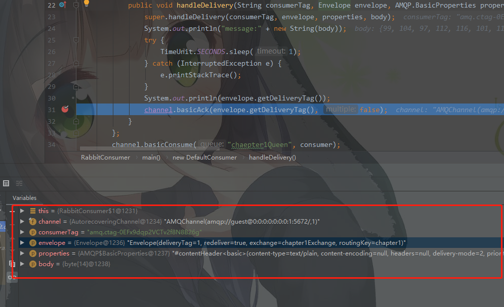
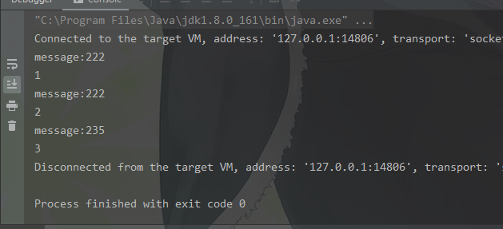

#创建消费者

##消费在上一章生产的一条消息:

##代码
```java
package com.example.rabbit.chapter2;

import com.rabbitmq.client.*;

import java.io.IOException;
import java.util.concurrent.TimeUnit;
import java.util.concurrent.TimeoutException;

public class RabbitConsumer {
    public static void main(String[] args) throws IOException, TimeoutException, InterruptedException {
        ConnectionFactory factory = new ConnectionFactory();
        factory.setPort(5672);
        factory.setHost("localhost");
        factory.setUsername("guest");
        factory.setPassword("guest");
        Connection connection = factory.newConnection();
        Channel channel = connection.createChannel();
        channel.basicQos(64);
        // 创建一个消费者
        Consumer consumer = new DefaultConsumer(channel){
            // consumerTag 是消费者的tag 标识消费者
            // 是生产发来的全局唯一的tag相当于数据库的主键,以便于在应答的时候发送给RabbitMQ告诉RabbitMQ 消费者消费的是哪个消息
            // envelope:RabbitMq 消息的基本信息 说明看下图
            @Override
            public void handleDelivery(String consumerTag, Envelope envelope, AMQP.BasicProperties properties, byte[] body) throws IOException {
                super.handleDelivery(consumerTag, envelope, properties, body);
                System.out.println("message:" + new String(body));
                try {
                    // 模拟接收消息处理..
                    TimeUnit.SECONDS.sleep(1);
                } catch (InterruptedException e) {
                    e.printStackTrace();
                }
                System.out.println(envelope.getDeliveryTag());
                channel.basicAck(envelope.getDeliveryTag(), false);
            }
        };
        // 将消费者绑定到队列中去,设置接收到消息的回调对象,如果收到消息将调用consumer中的方法
        channel.basicConsume("chaepter1Queen", consumer);
        // channel 要在ack 应答之后关闭:因为ack应答方法中检查了channel是否已经关闭,如果关闭会抛异常
        TimeUnit.SECONDS.sleep(5);
        channel.close();
        connection.close();
    }
}
```

## envelope中的参数:
```    
     简单先了解这么多后续再深入
     // RabbitMQ消息的Tag从1开始递增,表示此消息的全局唯一id,消费成功消费后会返回此tag告诉RabbitMq是哪条消息被成功消费了
     private final long _deliveryTag; 
     // 是否重新递送
     private final boolean _redeliver;
     // 交换机名称
     private final String _exchange;
     // 队列的routingKey
     private final String _routingKey;
```
每发送一个消息tag就自动+1


```     
        TimeUnit.SECONDS.sleep(5);
        channel.close();
        connection.close();
```
#注意点:
在关闭通道和前阻塞5秒是因为通道和连接关闭要在Consumer ack 应答后关闭,否则将无法完成应答
下图为应答处理中检查通道是否处于开启状态


