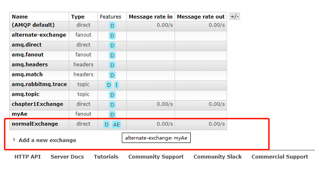
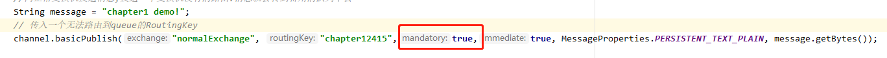
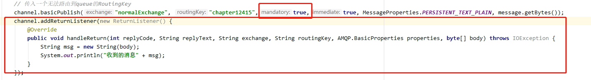

# 第三章 一些简单的思考和应用

#### 1.生产者生产的消息只能存在对应的queue中.
#### 2.多个消费者同时监听一个队列时queue中的消息时通过轮询的方式获取消息.每条消息只能发送到一个消费者程序中.不存在多个消费者同时消费一条消息的情况即queue不存在广播的方式.
#### 问:如何保证生产者生产的消息一定会发送到RabbitMQ Service(Broker)中呢?
`
答: 可以通过 confirm 模式保证消息可靠性,如果网络不可达要保证消息的幂等性.可以通过
      Broker内部生产的 inner-msg-id 全局唯一 （1）全局唯一（2）MQ生成，具备业务无关性，对消息发送方和消息接收方屏蔽
`  
  具体可浏览网页: <a href='https://cloud.tencent.com/developer/article/1048675'>消息总线真的能保证幂等</a>
### RoutingKey BindingKey 关系:
`
 交换器和队列时通过BindKey绑定. 根据不同的路由规则生产者发布消息时通过routingKey 和路由模式找到相应的队列存储消息.
 direct模式下BindingKey和RoutingKey 必须完全相同才可以被queue接收(这种模式下RoutingKey就是BindingKey).
`
## 交换器类型 fanout direct topic headers
`
 fanout 模式:生产发布消息到交换机,交换机会把这条消息分发到与交换机绑定的队列中
 direct 模式:交换机会直接把消息发送到与BingKey完全相同的队列上去
 topic 模式: . 代表字符串直接的分隔符,* 代表一个字符串 # 代表多个字符串 模糊匹配,如果不加 . 则表示完全匹配
 headers 模式: 这种模式性能差,不实用.

`

 ## 备份交换机 
 ### 如果交换机声明一个备用交换机则生产者发送给交换机的RoutingKey没有路由到queue则此条消息将被转发给备用交换机中去
 `
   被用来做备用交换机的交换机路由模式应该为 fanout 模式,因为备用的交换机的路由和主交换机的路由时一样的设置为direct模式或者topic模式可能会收不到消息
 `
 ### 绑定一个备份交换机
  `
   给交换机添加参数 [alternate-exchange:被用来当作备用交换机的名称]
  `
  页面中鼠标放在AE上可以看到绑定的备用交换机名称:
  
 ### 与channel.basicPublish方法中的mandatory参数作用相同。
    - mandatory = true 表示交换机没有路由到queue时将消息返回给消息生产者。
    - mandatory = false 表示交换机没有路由到queue时消息会直接丢弃。
    - 如果同时实用 alternate-exchange参数和mandatory参数则alternate-exchange参数会覆盖mandatory参数。
 #### mandatory 参数的实用方式 :
 
 #### 要添加 Listener监听未被路由到的消息。
 
    